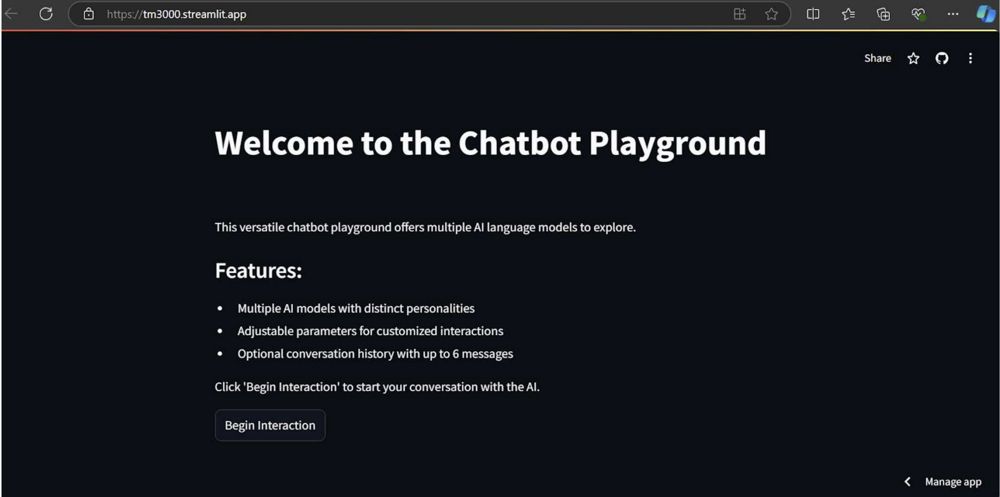
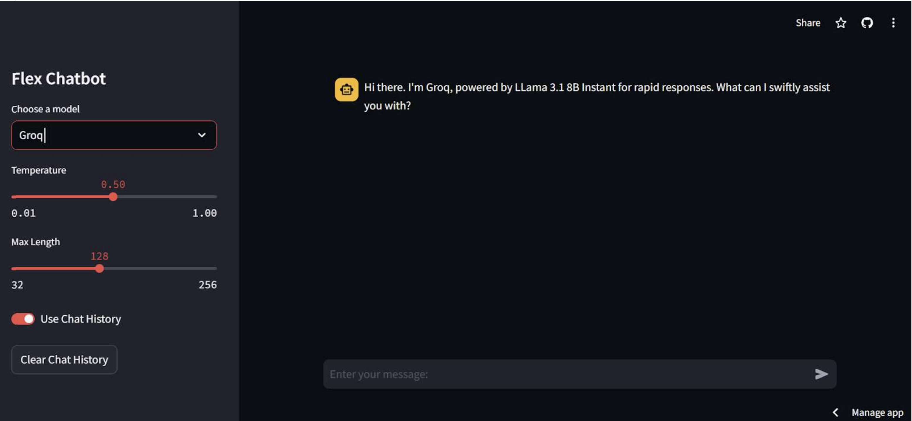

# TM3000
 
# 🧠 Advanced AI-Powered Chatbot Platform

This project demonstrates technologies aligned with my ITRI internship in AI and healthcare applications. It’s a flexible chatbot app that integrates multiple AI language models—including a custom Retrieval-Augmented Generation (RAG) bot—with user-adjustable parameters and conversational memory.

🔗 [GitHub Repo](https://github.com/e40125/TM3000)

---

## 🚀 Project Overview

A modular chatbot platform built with **Streamlit** and **LangChain**, enabling users to interact with several AI personalities, each offering a unique conversational style or purpose.

### ✨ Key Features

- Multiple AI agents with adjustable personalities and parameters
- Custom RAG-powered chatbot for context-aware responses
- Seamless model switching via a sidebar UI
- Support for up to 6-message conversation history
- Streamlit-based web interface with interactive sliders and toggles

---

## 🔧 Technologies Used

- Python
- Streamlit
- LangChain
- OpenAI and Groq APIs
- Retrieval-Augmented Generation (RAG)

---

## 👨‍💻 My Contributions

- Architected and implemented the entire chatbot system
- Integrated multiple language models and agents
- Built RAG + LangChain-based bot
- Developed frontend UI for dynamic user control
- Implemented error handling and memory management features

---

## 📸 Screenshots

---

## ✅ Results

- Functional chatbot app with multiple AI personalities
- Demonstrates advanced RAG-based NLP workflows
- Modular and scalable architecture for future model integrations

---

## 🧪 Try It Out

📦 [Codebase](https://github.com/e40125/TM3000)
